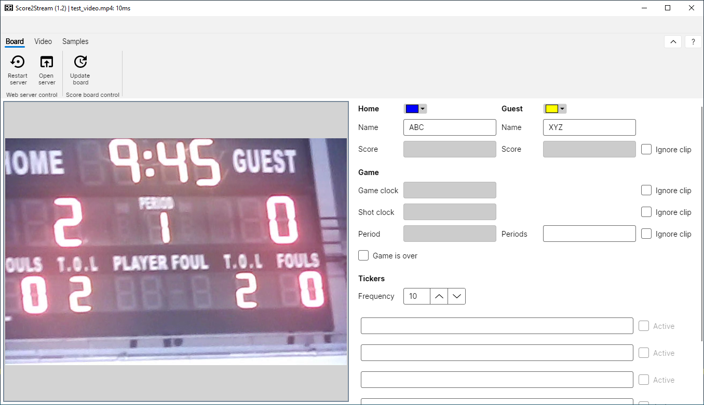
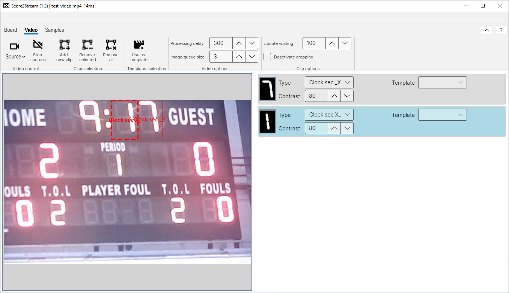
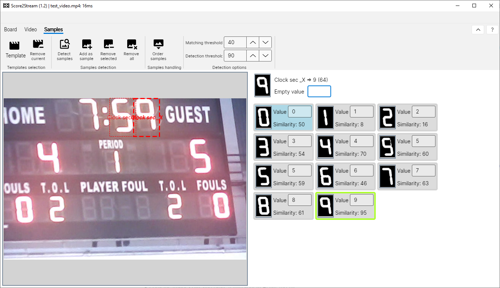
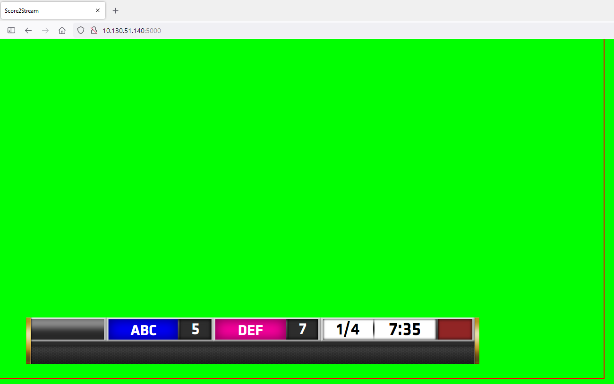

# Score2Stream

Score2Stream is a freeware to read and capture scoreboards of sports events and show its content as tv graphics in video live streams. The idea was inspired by [Scoreboard-webcam-OCR](https://xy-kao.com/projects/scoreboard-ocr-with-python-webcam/) by Xiaoyang Kao.

## Screenshots

Scoreboard view:

Clips view:

Samples view:

Graphics output:

## Usage

The configuration of Score2Stream consists of the following steps:

1. Selecting webcam as the input source (this can be a video file for testing purposes too).
2. Defining the clips which contain the digits of the scoreboard.
3. Selecting one or multiple clips as a sample template for values.
4. Identifying samples with values to be used.
5. Setting all scoreboard values.
6. Using the graphic as output for the stream.

### Selecting the input

The input can be selected by clicking *Video -> Source*. If a new webcam is added to the computer, the system must be started again to identify the new source.

It is also possible to add a video file to test the application's handling. The file can be added by clicking *Video -> Source -> Select file...*.

All inputs can be stopped by clicking *Video -> Stop sources*

### Defining a clip

If the source is visible on the video view (left part of the application), a clip can be selected by clicking *Video -> Add new clip*.

A new clip definition is shown on the editing view (right part of the application). You can define the clip region by selecting the area with the mouse in the video view. You can always change the clip's location by reselecting it with the mouse.

When the clip is selected, you can immediately see the resulting monochrome (black/white) outlook in the editing view. If the image is hard to identify, then you should adjust the contrast of the clip by changing the value of *Contrast*.

Furthermore, you should define its purpose by changing the value of *Type*. You can select one of the following types:

| Type 					| Description 															|
|-----------------------|-----------------------------------------------------------------------|
| *Period*				| Digit of the current period                                           |
| *Clock min X\_*		| Left digit of the game clock minutes shown in the graphic             |
| *Clock min \_X*		| Right digit of the game clock minutes shown in the graphic			|
| *Clock sec X\_*		| Left digit of the game clock seconds shown in the graphic				|
| *Clock sec \_X*		| Right digit of the game clock seconds shown in the graphic			|
| *Clock splitter*		| Splitter character between minutes and seconds (it is *:* by default)	|
| *Shot X\_*			| Left digit of the shot clock seconds shown in the graphic             |
| *Shot \_X*			| Left digit of the shot clock seconds shown in the graphic             |
| *Score home X\_\_*	| First digit of the home team score shown in the graphic               |
| *Score home \_X\_*	| Second digit of the home team score shown in the graphic              |
| *Score home \_\_X*	| Third digit of the home team score shown in the graphic               |
| *Score guest X\_\_*	| First digit of the guest team score shown in the graphic              |
| *Score guest \_X\_*	| Second digit of the guest team score shown in the graphic             |
| *Score guest \_\_X*	| Third digit of the guest team score shown in the graphic              |
| *Fouls home*			| Single digit of the home team fouls shown in the graphic              |
| *Fouls guest*			| Single digit of the home team fouls shown in the graphic              |

**Please note that you must NOT select all values. E.g., it is possible to use the game clock digits only but not use the other content.**

### Using as a template

If a clip is selected, it can be used as a sample template by clicking *Video -> Use as template*.

**Please note that you don't need to define a template for each clip. You can reuse an existing template for another clip by changing the value of *Template*.**

When a clip is used as a template, the template tab is opened, and the clip content is shown on the editing view (the right part of the application). Now the sample values can be defined by either:
* Adding each new sample step-by-step when it it appears on the clip by clicking *Templates -> Add as sample*, or
* Using the detection functionality by clicking *Templates -> Detect samples*.

The latter function automatically adds new samples when all existing samples' similarity value is below the detection threshold (see *Samples -> Detection threshold*). If the part is activated, the sample view on the right side has a yellow background. **Don't forget to deactivate the detection if you have once collected enough values ;-)**

### Defining the sample values

You can immediately define a new sample's value by putting it into the text box. You can easily switch between the values by using the *TAB* button. Unnecessary samples can be deleted by clicking *Samples -> Remove selected* or using the keyboard combination *CTRL + DEL*.

### Setting up the scoreboard

Now you are ready to use the scoreboard. Therefore, open the *Board* tab. All previously defined clips should now be visible in the respective boxes (e.g., the game clock, if you set this). Directly you can input all missing values (e.g., the home team and guest team names, number of periods, etc.).

**Please note that when you change a value, it is not shown immediately on the graphic. The adjusted values are marked with an orange background. To set the changed values in the graphic, you must click *Board -> Update board.*.**

The text boxes at the bottom are ticker entries in the graphic. The changing period of the ticker (in seconds) can be set above the boxes.

### Using the output

The resulting graphic can be started. To open the output, click *Board -> Open server*. It opens a website containing the graphic, which can be integrated into a web stream. With version 1.3 you must not be connected to the internet anymore to receive the website.

The website address and the used ports are currently hard-coded and cannot be changed.

## Optional settings

The following optional settings can be set:

| Setting							| Description	|
|-----------------------------------|---------------|
| *Video -> Processing delay*		| The delay between capturing two images in milliseconds. By adjusting this value, you can minimize the computational load of the app. |
| *Video -> Image queue size*		| The number of the last X images merged into the resulting output image. Sometimes the input is flickering. By merging the images, the resulting output minimizes the impact of this effect. |
| *Video -> Deactivate cropping*	| If this value is activated, then the clips are used as defined by the selection. By default the content of the clips is centered and only main objects are detected. |
| *Template -> Matching threshold*	| The similarity value must be reached that a sample is considered as value. Otherwise, the value is used, which is defined in *Empty value* |
| *Template -> Detection threshold*	| The value of similarity under which a new sample is created in the detection mode (see above). |
| *Template -> Update waitíng*		| The number of milliseconds waited until a changed value is considered. Sometimes the input is flickering. Using this value, you can ensure that changes must exist for a minimum time until they are considered. |
