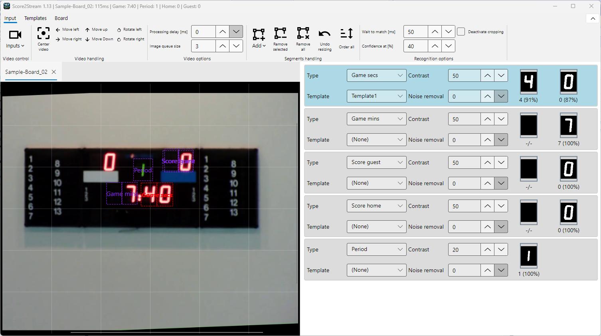
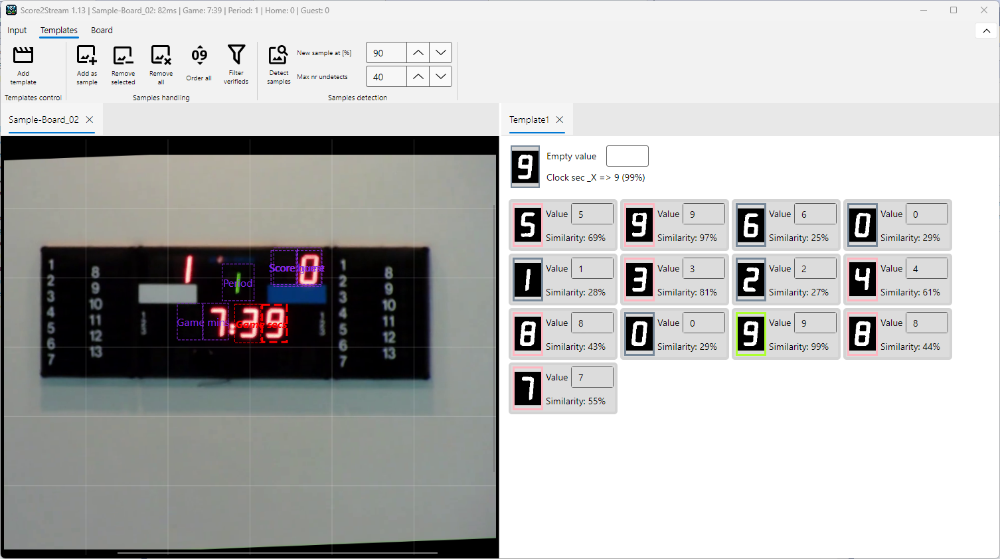
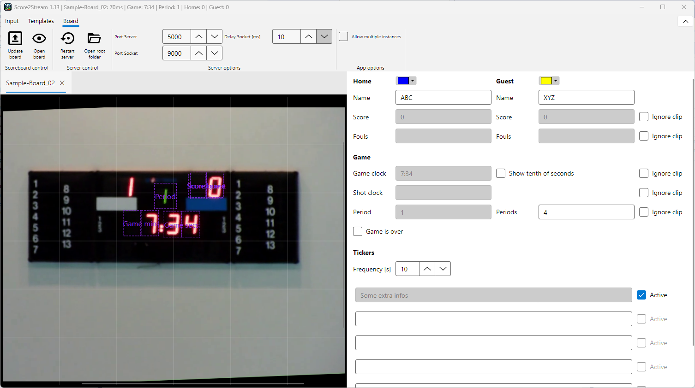
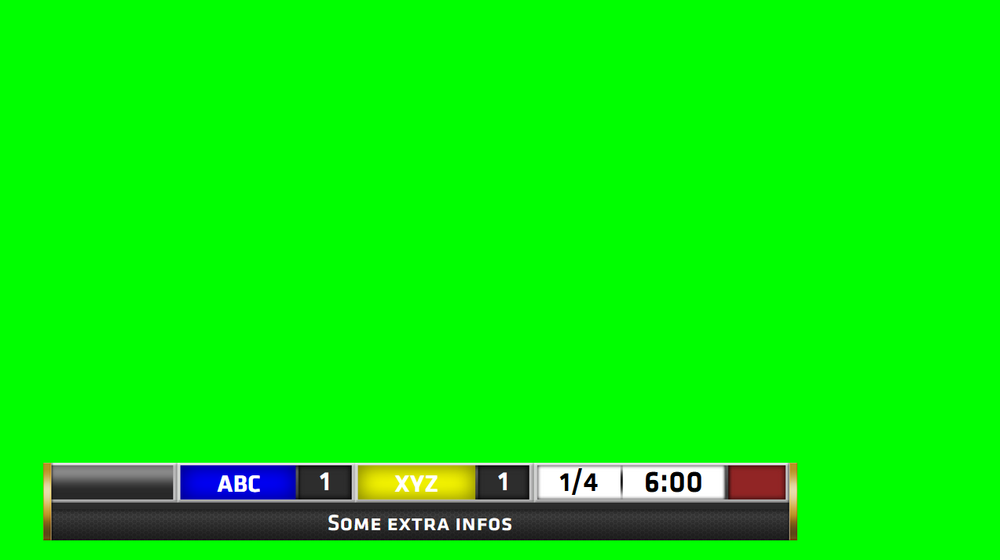

# Score2Stream

Score2Stream is a free, open-source tool that reads scoreboards of sports events and other digital displays using a video camera, recognizes the displayed values through image processing, and outputs the result as a TV graphic for live streams. The graphic is served via a built-in web server as an HTML page and can be integrated directly into tools like OBS or other streaming software.

The idea was inspired by the project [Scoreboard-webcam-OCR](https://xy-kao.com/projects/scoreboard-ocr-with-python-webcam/) by Xiaoyang Kao.

**No training required:** Score2Stream ships with pre-built sample data for a wide range of common digital sports displays. Once a segment is placed on the scoreboard, the digits are typically recognized immediately — out of the box, no manual training needed. Custom samples can be added if required, but are usually unnecessary for standard displays.

The tool consists of three tabs: **Input**, **Templates**, and **Board**.

---

## Input

The Input tab is where the video source is configured. Clicking the *Inputs* button lists all currently available cameras or video files. The list refreshes on each click. Once a source is selected, it is displayed in the video view on the left.

The image can be repositioned (left/right, up/down) and rotated using the controls in the *Video handling* section. These adjustments are preserved after segments are defined.

**Segments** are rectangular regions drawn directly onto the video image, each covering one display area of the scoreboard — for example, a single digit of the game clock or the score. Each segment is assigned a meaning via the *Type* dropdown, such as *Game mins*, *Game secs*, *Shot clock*, *Score home*, *Score guest*, *Period*, and others.

Additional processing options:

| Option | Description |
|---|---|
| **Image queue size** | Number of consecutive frames merged into a single output image before processing. Useful for LED displays whose refresh rate exceeds the camera frame rate, causing individual frames to appear incomplete. |
| **Processing delay [ms]** | Delay between processing steps in milliseconds. Primarily useful when testing with imported video files that would otherwise play back too fast. |
| **Confidence at [%]** | Minimum recognition confidence in percent. If the match falls below this threshold, the *Empty value* defined in the Templates tab is output instead. |
| **Wait to match [ms]** | Time in milliseconds a changed value must persist before it is accepted. Prevents flickering caused by briefly unstable input. |

---

## Templates

The Templates tab is used to define reference images (samples) for recognition. A template is assigned to one or more segments and contains the sample images against which the live camera frames are compared.

Samples can be added in two ways:

- **Manually:** Select a segment, wait for the desired value to appear, and click *Add as sample* to capture it as a reference image. Then enter the correct value in the text field.
- **Automatically (Detect samples):** The tool automatically captures new samples whenever the similarity to all existing samples falls below the threshold set in *New sample at [%]*. For example, at 90%, a new sample is created as soon as the current image differs by more than 10% from all known samples.

Additional settings:

| Option | Description |
|---|---|
| **Max nr undetects** | Maximum number of unrecognized frames before a new sample is created automatically. |
| **Empty value** | Value output when recognition confidence falls below the *Confidence* threshold. Can be left blank or set to a placeholder such as `-`. |

> **Note:** Deactivate the detection mode once enough samples have been collected.

---

## Board

The Board tab controls the graphic output. Recognized values are transmitted to the HTML graphic page via a built-in web server and a WebSocket connection as a JSON stream.

On the right-hand side, values can be entered manually or used to override automatically detected values by enabling *No detection*. Changes are not transmitted to the graphic immediately — the *Update board* button must be clicked to apply them. The button activates automatically as soon as any value on the right-hand panel is modified.

Available actions and settings:

| Option / Action | Description |
|---|---|
| **Update board** | Applies changed values to the graphic output. |
| **Open board** | Opens the current scoreboard graphic in the local browser. |
| **Restart server** | Restarts the built-in web server. |
| **Open root folder** | Opens the server folder where custom HTML graphic pages can be placed. |
| **Port Server / Port Socket** | Ports used for the HTTP server and the WebSocket connection. |
| **Delay Socket [ms]** | Update interval of the WebSocket data transmission in milliseconds. |

---

## Output

In addition to the included sample scoreboard, custom HTML graphics can be created and placed in the root folder. The graphic page receives all values — score, game clock, shot clock, team names, period, fouls, and more — via WebSocket as a JSON stream and can render them in any desired layout.

The output is designed to be used as a browser source in OBS or similar streaming tools, with full support for transparency (chroma key or CSS-based).

---

## Optional Settings Summary

| Setting | Description |
|---|---|
| *Image queue size* | Frames merged per output image (reduces LED flicker artifacts). |
| *Processing delay [ms]* | Delay between capture cycles (useful for video file testing). |
| *Confidence at [%]* | Minimum match confidence; below this, the empty value is shown. |
| *Wait to match [ms]* | Minimum duration a value must be stable before being accepted. |
| *New sample at [%]* | Similarity threshold below which a new sample is auto-created in detection mode. |
| *Max nr undetects* | Cap on unrecognized frames before auto-sample creation triggers. |
| *Empty value* | Fallback value shown when no confident match is found. |
| *Delay Socket [ms]* | WebSocket update interval for the graphic output. |
